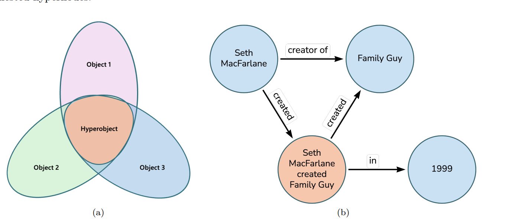

```{r setup, include=FALSE}
knitr::opts_chunk$set(echo = TRUE)
```

## Literature Review Graph-Based RAG

This section summarizes different research papers which employ Graph-Based Retrieval-Augmented Generation (RAG) and normal RAG approaches.

### Paper 1: [KG-RAG](https://arxiv.org/pdf/2405.12035)

This paper introduces a novel framework (KG-RAG) that aims to enhance the reasoning abilities of LLMs by integrating them with Knowledge Graphs (KGs). This integration addresses significant challenges faced by LLM-agents:

-   Information hallucination, catastrophic forgetting & limitation in processing extended contexts for knowledge intensive tasks.

    {width="482"}

RAG systems primarily rely on similarity search for retrieval. This approach, however, falls short when handling more complex queries. The limitation lies in its inability to precisely focus on the most relevant information, which results in retrieving numerous text chunks. These chunks often contain excessive or insufficient data, leading to an overload of irrelevant information. KGs can extend this RAG system by incorporating a explicit and accurrate representation of entities and relationships, which are more accurate than retrieving information through vector similarity.

**Knowledge Graph:**

-   Knowledge Triplets: (entity) - [relationship] - (entity) (A basic unit of information in the graph)
    -   Triplet $t = (e,r,e')$, where $e$ is the entity, $r$ = the predicate relationship and $e'$ is the object entity.
    -   A Graph $G=\left\{t=\left(e, r, e^{\prime}\right) \text {, where } e, e^{\prime} \in E, r \in R\right\}$

**Knowledge Graph Question Answering (KGQA)\
**The idea of KGQA is to respond to questions with information from the KG. For complex queries, this requires the infromation retrieval (IR) of multiple triplets. We can use a multi-hop traversal path: $w_z=e_0 \xrightarrow{r_1} e_1 \xrightarrow{r_2^1} \ldots \xrightarrow{r_l} e_l$., which connects a series of entities via relationships. Given a natural question $q$ and a KG $G$ a function $f$ should predict an answer $a \in A_q$ based on knowledge from $G$ . The predicted answer $a^*$ is computed by **maximizing** the probability of possible answers across all relevant paths $w_z$. Formally:

$a^*=f(q, G)=\underset{a \in A}{\arg \max } \sum_z P\left(w_z \mid q, G\right) \cdot P\left(a \mid w_z\right)$

where $P\left(w_z \mid q, G\right)$ represents the model's ability to identify the most relevant paths $w_z$ given the question $q$ and the KG $G$, and $P\left(a \mid w_z\right)$ denotes the probability of generating the answer $a$ based on the path $w_z$.

**Few-Shot Learning:\
**Few Shot learning is used to help the LLM extract the triplets from the text chunks. In this approach examples are provided to the LLM to help the model. Given a text chunk $T$ the LM must identify the different triples $t=\left(e, r, e^{\prime}\right)$: $T \xrightarrow{L M}\left\{t_i\right\}_{i=1}^n$

**Retrieval:**

Given a question $q$ and a KG $G$ the retrieval problem is a search problem, where the objective is to find paths $w_z$ within the graph $G$ that connects the relevant entities through relationships that are appropriate to the question:

$\operatorname{IR}=\underset{w_z}{\arg \max } P\left(w_z \mid q, G\right)$

The idea is to maximize tge conditional probability $P\left(w_z \mid q, G\right)$, where $w_z$ represents a path in $G$ that is most likely to answer the query $q$.

**Answer Generation: \
**Takes the question and extracted path information to get the most logical answer from the LM.

**Triple Hypernode\
**Extend the standard triple representation to allow for more intricate multi-layered relationships. These hypernodes contain nested triples and allow for nesting relationships within relationships.



**Chain of Explorations (CoE):**

COE is the retrieval algorithm employed by the paper. It is responsible for locating and extracting the most relevant paths within the KG. The idea is to retrieve sub-graphs or paths, which contain the necessary information. It traverses through nodes and edges relevant to the query $q$.

1.  **Exploration Plan Generation:**
    -   The CoE process begins with an **exploration plan,** which is the sequence of steps that defines how to navigate the KG. This plan is generated based on $G$ and $q$.

    -   To create this plan, the system uses a few-short learning prompt along with an LLM. This helps in defining logical steps for traversing the KG to retrieve relevant information, related to the query.
2.  **Starting the Exploration**
    -   The exploration starts by identifying the **initial set of nodes in** the KG, most relevant to the query. I.e., "Which is the former husband of Elisabeth Taylor died in Zurich. ", the starting node could be Elisabeth Taylor.

    -   The initial node candidates are identified using vector similarity search. The candidates are thus transformed into vectors and then a similarity search is done on the KG, in order to compare the two. Cypher language is used in order to do so.
3.  **Sequential KG Lookups:**
    -   CoE performs a sequential lookup, to explore connected nodes and relationships. At each step:

        -   **Node Exploration:** The algorithm looks for nodes (entities) that are directly connected to the current node and are relevant to the query. I.e. is married to, could indicate the husband.

        -   **Relationship Explorer:** It examines the possible relationships (edges) between the nodes. I.e. After detecting the Husbands name we may use the relationship "died in" to identify the place of death.

        -   **Filtering & Ranking Nodes/Guided Relationship Exploration** is done using the LLM.
4.  
