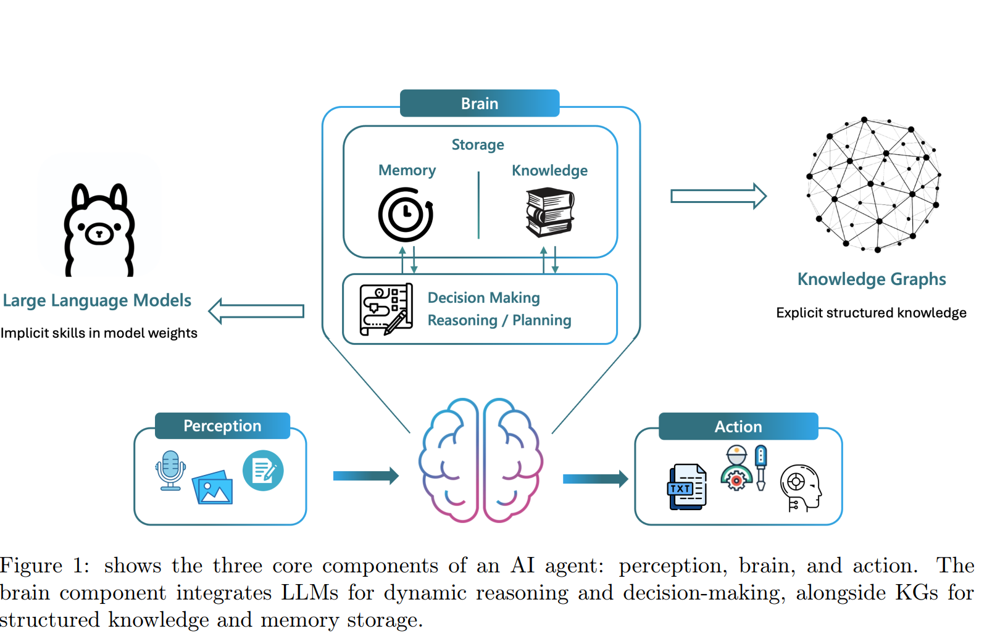

```{r setup, include=FALSE}
knitr::opts_chunk$set(echo = TRUE)
```

## Literature Review Graph-Based RAG

This section summarizes different research papers which employ Graph-Based Retrieval-Augmented Generation (RAG) and normal RAG approaches.

### Paper 1: [KG-RAG](https://arxiv.org/pdf/2405.12035)

This paper introduces a novel framework (KG-RAG) that aims to enhance the reasoning abilities of LLMs by integrating them with Knowledge Graphs (KGs). This integration addresses significant challenges faced by LLM-agents:

-   Information hallucination, catastrophic forgetting & limitation in processing extended contexts for knowledge intensive tasks.

    {width="482"}

RAG systems primarily rely on similarity search for retrieval. This approach, however, falls short when handling more complex queries. The limitation lies in its inability to precisely focus on the most relevant information, which results in retrieving numerous text chunks. These chunks often contain excessive or insufficient data, leading to an overload of irrelevant information. KGs can extend this RAG system by incorporating a explicit and accurrate representation of entities and relationships, which are more accurate than retrieving information through vector similarity.

**Knowledge Graph:**

-   Knowledge Triplets: (entity) - [relationship] - (entity)

Summary of KG-pipeline: Extract triplets from raw text, store them in a KG database. Use this KG as knowledge for the RAG system.
