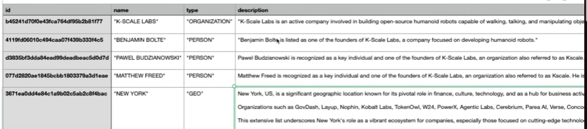
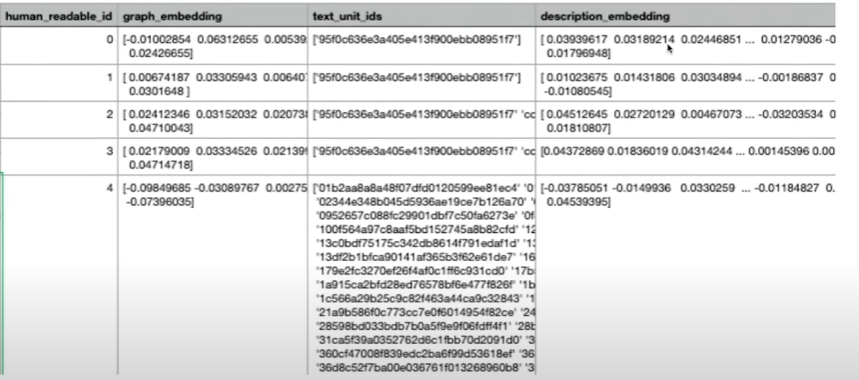
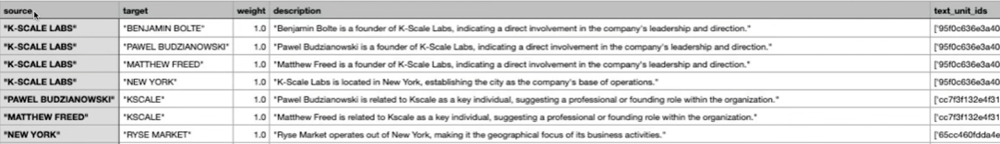

```{=html}
<style>
ul {
  padding-left: 20px; /* Adjust this value to change the left padding */
}

ul li {
  margin-bottom: 5px; /* Adjust this value to change the space between list items */
}
</style>
```
## Literature Research on Knowledge Graphs & LLM

### GraphRAG by Microsoft

Sophisticated system designed by Microsoft research for very large datasets. Transforms raw data (unstructured) into structured and semi-structured hierarchies and communities.

**Traditional Graph Systems**

Normal RAG suffers from:

-   Contextual depth
-   Scalability in evolving datasets.

We can incorporate GraphRAG, when we want the LLM to provide answers that reflect deeper links and relationships within the data. This is useful if we want to handle large and evolving datasets efficiently. The secret sauce of GraphRAG is **community construction:**

1.  **Entity Detection**: GraphRAG scans the dataset to identify and categorize entities.
2.  **Relationship Mapping:** Examine the connections between these entities, mapping out the relationships that bind them.
3.  **Community Clustering:** Group these entities into communities, that represent closely knit clusters of related information. i.e., a group of companies working in a certain space, etc.

**The indexing Pipeline:** e2e Knowledge Graph creation pipeline. ([Indexing Dataflow](https://microsoft.github.io/graphrag/posts/index/1-default_dataflow/), [Medium](https://thecagedai.medium.com/graphrag-redefining-knowledge-extraction-97fb3d8f9bec))

### **Phase 1: Compose Text Units**

In a first step some initial processing happens for the raw input data. A Text Unit is a chunk of text that is used for the graph extraction and is also employed as a source-reference. The size of the text chunk can be defined by the users (default 300 tokens). This chunk size determines the granularity of the Text Units. This helps capture enough detail inside the text without loosing the context. What is the impact of Chunk Size:

-   **Larger Chunks:**
    -   *Faster Processing Times:* number of text segments to process is reduced. Less time is needed to retrieve and process the information from multiple chunks.
    -   *Context Preservation:* Larger chunks retain more context, which can beneficial for tasks that require a broader range of context.
    -   *Potential loss of granularity:* Larger chunks keep more context, however might dilute the specific focus on fine-grained details i.e., subtle relationships. Also these provide less meaningful reference texts.
-   **Smaller Chunks:**
    -   *Improved Data Completeness:* Smaller chunks provide finer granularity, allowing the system to focus on more specific pieces of information.
    -   *Detailed and Focused References:* Because smaller chunks concentrate on smaller sections of text, the extracted information is often more precise and relevant. This is especially important for entity extraction.
    -   *Increased processing:* More chunks lead to more retrieval and processing operations (time & resources).

**Grouping Configuration**

Next, the GraphRag system aligns chunks to the document boundaries. As such, we end up with a **1-to-Many** chunk-document relationship. We thus have one chunk per document. This preserves the document's contextual integrity. For shorter documents we can adjust this to **Many-to-Many.**

Each chunk is then **text embedded** (an embedding is created for each of our text chunks).

The output for our document is as follows:

1.  chunk: Chunk of the text in a specific size i.e., 200 tokens
2.  chunk_id: Id of the chunk
3.  document ids: [list of corresponding document ids.
4.  n_tokens: the token size

### Phase 2: Graph Extraction

***Transforming TextUnits into a Structured Knowledge Graph\
***This transforms the raw TextUnits into a graph that we can query. In this phase we extract the primitives from the textunits:

-   **Entities:** Represent people, places, events, or some other entity-model provided.
-   **Relationships:** A relation between two entities. These are generated from the *covariates*.

These are extracted using LLMs. Each textunit is processed in order to extract the entities & relationships out of the raw text. We end up with a sub graph for each textunit:

-   TextUnit containing a list of e**ntities** with a *name*, *type*, and *description*
-   list of **relationships** with a *source*, *target*, and *description*.

The sub-graphs are then merged together. Entities with the same *name* and *type* are merged by creating an array of their descriptions (Entity Resolution). The same happens for the relationships. Relationships with the same source and target are merged by creating an array of their descriptions.

The next step is entity & Relationship Summarization. We have a graph with entities & relationships, each containing a list of descriptions. We now summarize these lists into a single description per entity & relationship. This is achieved by prompting the LLM to create a summary of the descriptions. In the end each entity and relationship contains a single description.

Claims can be extracted as well but are left out by default.\
This is an Entity:





**Relationship:**



### Phase 3: Graph Augmentation

This part is about understanding the community structure of our graph and then augment it. This step is performed in two steps:

1.  **Community Detection**
    -   Detecting clusters/groups of nodes (entities) that are densely connected together (more than the rest of the graph). These communities are a set of nodes that have something in common (shared attributes/roles). This allows for later summarization of the graph at later stages at different granularities.

    -   **Method:**

        -   Using the Leiden Algorithm for community detection, a hierarchy of entity communities is created. This method works by iteratively refining communities to optimize a measure called **modularity**.

            -   *Local Moving Nodes*: Nodes are moved to different communities to increase the quality of partitioning based on granularity.

            -   *Refinement of Partitions*: The partitions are refined to ensure that the communities are well-connected internally.

            -   *Aggregation of the Network:* Communities are aggregated into single nodes, and the process is repeated.

        -   This entire process is done iteratively. Once a set of communities is identified, the algorithm is applied again within each community to find sub-communities. This continues until a **community-size threshold** is reached. For example, if we set the threshold at 5 nodes, the recursive clustering stops when all sub-communities have at least 5 nodes.
2.  **Graph Embedding:**
    -   Transforms a graph into a geometric space. A vector representation is created of the graph is created using the node2vec algorithm. This allows to understand the implicit structure of the graph. We can see the contextual connections between different nodes.

**Graph Table Emission:** We end up with **Entities** and **Relationships** tables after their text fields are text-embedded.

### Phase 4: Community Summarization

We have a functional graph of entities and relationships, a hierarchy of communities for the entities and the node2vec embedding. The goal of this phase is to create a report for each community. I.e., if A is the top level community it will give us a report about the entire graph, otherwise we get one about a local cluster.

1.  Generate community reports: Done by LLMs (gives us a scoped understanding of the graph). These reports contain an overview and reference the key entities/relationships within the community sub.-structure.
