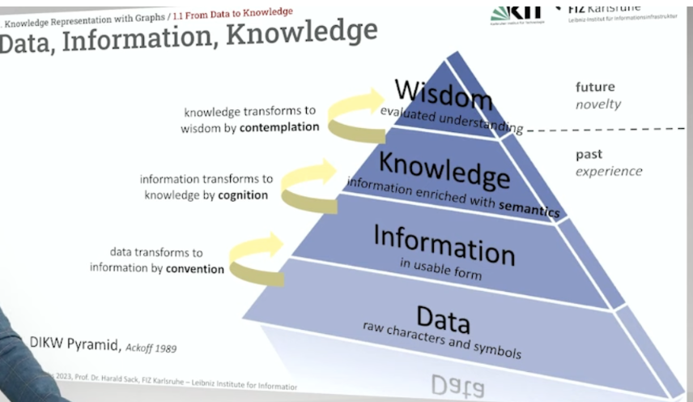
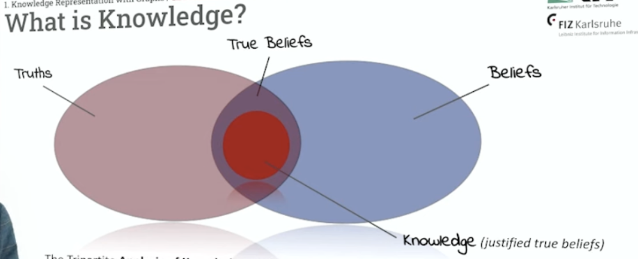

```{=html}
<style>
ul {
  padding-left: 20px; /* Adjust this value to change the left padding */
}

ul li {
  margin-bottom: 5px; /* Adjust this value to change the space between list items */
}
</style>
```
## YouTube Video Summary

This is a summary of the playlist from the YouTube Series [YouTube](https://www.youtube.com/watch?v=CiU1sMbL3k4&list=PLNXdQl4kBgzubTOfY5cbtxZCgg9UTe-uF).

### Lecture 1: Knowledge Representation with Graphs

We want to first understand how to get from data to knowledge and how we can represent this knowledge. It is important to note, that the same word can have several meanings. I.e., the number 42:

-   It can be a **code,** a **quantity** or even a **weight** $\rightarrow$ We need more information.

**What is data?\
**Data is raw. It simply exists and has no significance beyond its existence (in and of itself). It can exist in any form, usable or not. If we want to use it we need information.

**What is Information?\
**Information is data that has been given meaning by the way of *relational connection*. This "meaning" can be useful, but does not have to be. Information is contained in descriptions. Also, information often answers questions, that begin with a w-word: what, who, when and where.

**What is Knowledge?**

Knowledge is an appropriate *collection of information*, such that its intended use is useful. Wisdom is the ability to make sound judgement and decisions (This comes from the accumulation of knowledge). Understanding is a continuum that leads from data, through information and knowledge and ultimately to wisdom.\
{width="396"}

We can understand knowledge the following way. We can see, that there are **truths** in the world. What we believe to be the truth are called **believes.** Some of our believes are true and some are not. The ones which are, are called **justified believes.**

> "Knowledge is a justified subset of all true believes" - Stanford Encyclopedia\
> "People cannot share knowledge if they don't speak a common language" - Daveport & Prusak

**Mathematical\
**For a proposition $p$ to be considered knowledge, the following must apply:

1.  **Truth** ($p$ is true): For someone to know something, the proposition $p$ must be true. If $p$ is false it cannot be known; Only truths can be known.
2.  **Relives (**$S$ believes that $p$): The person $S$ must believe the proposition $p$. Knowledge cannot exist without believe.
3.  **Justification (**$S$ is justified in believing that $p$): The believe in $p$ must be justified. This means there must be some form of evidence or rational basis for $S$ to hold the believe that $p$ is true.

{width="397"}

**How to speak a common language?**

1.  **Syntax:** Common symbols and concepts
2.  **Semantics:** Agreement about the meaning of these symbols
3.  **Taxonomy:** Classification of Concepts
4.  **Thesauri:** show the associations between concepts, like synonyms and antonyms.
5.  **Ontologies:** go a step further by defining not just the relationships but the rules and constraints that govern these relationships. I.e., in biology: "Mammal", "Bird", "Animal", Relationships: "A bird is a type of Animal" Rules: "Only birds have feathers"

### **Video 2:   **
